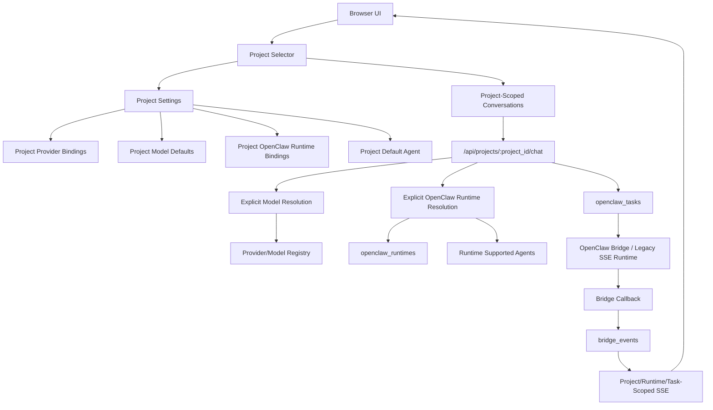

# Milestone 4: Project Workspace Architecture Design

Status: design only
Target version: v0.10.x / Milestone 4.x
Created: 2026-07-05

## Executive Summary

Milestone 4 makes Project Workspace the top-level architecture object in `web-ai-assistant`.

Today the application is centered on global conversations, global model settings, and OpenClaw task state keyed primarily by conversation and task. That shape worked for a single-user, single-workspace assistant, but it is no longer enough now that the system supports regular models, Hillsboro OpenClaw, Seattle OpenClaw, and different OpenClaw execution modes.

The Project layer must become the durable boundary for:

- Conversations
- Provider/model availability
- OpenClaw runtime bindings
- Default model
- Default OpenClaw runtime
- Default OpenClaw agent
- Future memory, knowledge base, and automation

The most important rule for this milestone:

**OpenClaw runtime resolution must be explicit and auditable. Do not silently infer Hillsboro or Seattle when a project has more than one OpenClaw runtime available.**

Hillsboro OpenClaw has production validation for recent Bridge Callback, SSE, and Remote Execution Console work. Seattle OpenClaw must not be treated as having the same Bridge behavior, agents, callbacks, or recovery semantics unless separately verified and marked as such in runtime metadata.

## Current State Analysis

### Existing Conversation And Message Structure

Current D1 migrations define:

```sql
CREATE TABLE IF NOT EXISTS conversations (
  id TEXT PRIMARY KEY,
  title TEXT,
  created_at INTEGER NOT NULL,
  updated_at INTEGER NOT NULL
);

CREATE TABLE IF NOT EXISTS messages (
  id TEXT PRIMARY KEY,
  conversation_id TEXT NOT NULL,
  role TEXT NOT NULL,
  content TEXT NOT NULL,
  created_at INTEGER NOT NULL,
  FOREIGN KEY (conversation_id) REFERENCES conversations(id) ON DELETE CASCADE
);
```

Later migrations add summary fields to `conversations`:

```sql
ALTER TABLE conversations ADD COLUMN summary TEXT;
ALTER TABLE conversations ADD COLUMN summarized_message_id TEXT;
ALTER TABLE conversations ADD COLUMN summarized_at INTEGER;
```

The current API exposes global conversation operations:

- `GET /api/conversations`
- `POST /api/conversations`
- `GET /api/conversations/:id/messages`
- `PATCH /api/conversations/:id`
- `DELETE /api/conversations/:id`
- `GET/PATCH /api/conversations/:id/summary`

There is no `project_id`. Conversation list, message retrieval, file context, summary updates, and OpenClaw task creation all assume conversation IDs are globally sufficient.

### Existing Provider And Model Configuration

There are two model/provider sources:

- Built-in model list in `src/providers/models.js`
- Persisted `settings` row with key `model_settings`

The global settings row stores normalized provider categories and provider configs. OpenClaw providers are currently represented as provider entries, for example:

- `openclaw-hillsboro`
- `openclaw-seattle`

Recent Phase 13.4 work added per-provider `openclawExecutionMode`:

- `legacy`
- `bridge`

Important current behavior:

- Missing persisted OpenClaw execution mode is normalized to `legacy`.
- Persisted provider mode wins over transient request data unless the incoming request explicitly sets a valid mode.
- `OPENCLAW_BRIDGE_MODE` remains a compatibility fallback, not the desired long-term source of truth.

This is a good bridge into Milestone 4, but it is still global. Project-specific provider binding does not exist yet.

### Existing OpenClaw Bridge Configuration

Current Bridge client configuration is environment-level:

```js
OPENCLAW_BRIDGE_BASE_URL
OPENCLAW_BRIDGE_TOKEN
OPENCLAW_CALLBACK_SECRET
OPENCLAW_CALLBACK_ALLOWED_BRIDGE_IDS
OPENCLAW_BRIDGE_MODE
```

Current OpenClaw task table:

```sql
CREATE TABLE IF NOT EXISTS openclaw_tasks (
  id TEXT PRIMARY KEY,
  conversation_id TEXT NOT NULL,
  provider TEXT NOT NULL,
  model TEXT NOT NULL,
  upstream_model_name TEXT,
  prompt_preview TEXT,
  status TEXT NOT NULL,
  started_at INTEGER NOT NULL,
  updated_at INTEGER NOT NULL,
  completed_at INTEGER,
  error TEXT,
  latency_ms INTEGER,
  assistant_message_id TEXT,
  remote_task_id TEXT,
  metadata TEXT,
  remote_status TEXT,
  remote_progress INTEGER,
  remote_message TEXT,
  cancelled_at TEXT,
  bridge_task_id TEXT,
  bridge_run_id TEXT,
  bridge_session_key TEXT,
  bridge_session_id TEXT,
  bridge_agent_id TEXT,
  bridge_result_hash TEXT,
  bridge_mode_enabled INTEGER DEFAULT 0,
  bridge_last_sequence INTEGER DEFAULT -1,
  bridge_last_seen_at TEXT
);
```

Current Bridge event table:

```sql
CREATE TABLE IF NOT EXISTS bridge_events (
  event_id TEXT PRIMARY KEY,
  task_id TEXT NOT NULL,
  conversation_id TEXT,
  assistant_message_id TEXT,
  event_type TEXT NOT NULL,
  sequence INTEGER,
  payload_json TEXT NOT NULL,
  created_at TEXT,
  received_at TEXT NOT NULL,
  bridge_id TEXT,
  applied INTEGER NOT NULL DEFAULT 0,
  duplicate INTEGER NOT NULL DEFAULT 0,
  error TEXT
);
```

Current SSE stream endpoint:

- `GET /api/openclaw/bridge/events/stream?task_id=...`

The in-memory SSE client map is keyed by task ID only. Event history is loaded by local task ID, bridge task ID, or remote task ID. There is no project or runtime scoping.

### Current Assumptions That May Break

These assumptions are unsafe for Project Workspace:

- Global `model_settings` applies to every future project.
- Global `OPENCLAW_BRIDGE_BASE_URL` is enough to identify the Bridge server.
- One callback secret and allowed bridge ID list is enough for all OpenClaw deployments.
- `bridge_id` is operationally equivalent to a runtime identity.
- `provider` identifies an OpenClaw deployment strongly enough for task routing.
- Task ID alone is enough to subscribe to SSE events.
- Conversation ID alone is enough to authorize message, task, and file reads.
- Hillsboro Bridge behavior can be reused for Seattle.
- A selected OpenClaw model implies the runtime.
- UI visual defaults can stand in for persisted runtime choices.

Milestone 4 must remove or contain these assumptions.

## Target Architecture



## Terminology And Identity Rules

### Provider

A Provider is a model-serving integration or catalog entry. Examples:

- `workers-ai`
- `glm`
- `kimi`
- `openclaw-hillsboro`
- `openclaw-seattle`

Provider answers: "Which provider configuration supplies this model?"

### Model

A Model is the selectable model or agent-facing model entry inside a provider. Examples:

- `@cf/meta/llama-3.1-8b-instruct-fast`
- `glm-5.1`
- `openclaw-hillsboro-main`
- `openclaw-seattle-glm51`

Model answers: "Which model/agent option did the user select?"

### OpenClaw Runtime

An OpenClaw Runtime is a concrete deployment endpoint and callback/security boundary. Examples:

- `openclaw-runtime-hillsboro-prod`
- `openclaw-runtime-seattle-prod`

Runtime answers: "Which OpenClaw deployment receives this task and emits callbacks?"

### OpenClaw Agent

An OpenClaw Agent is a runtime-specific agent identifier. Examples may include:

- `main`
- `glm51`
- `glm5-2`
- `kimi-for-coding`

Agent answers: "Which agent inside this runtime should handle the task?"

Agents are runtime-specific. The same agent ID string in Hillsboro and Seattle does not prove equivalent behavior.

### Project Default Model

The model used for a new conversation when the user has not selected a per-conversation model.

### Project Default OpenClaw Runtime

The runtime used for OpenClaw tasks only when a project has exactly one enabled eligible OpenClaw runtime or when the project has an explicit default runtime.

If multiple enabled OpenClaw runtimes are bound and no explicit runtime is selected/defaulted, the API must reject with a clear resolution error.

### Per-Conversation Selection

A conversation may pin:

- `selected_provider_id`
- `selected_model_id`
- `selected_openclaw_runtime_id`
- `selected_openclaw_agent_id`

Per-conversation selection overrides project defaults, but it must be visible and auditable.

## Proposed D1 Data Model

### Migration 4.1: Projects

```sql
CREATE TABLE IF NOT EXISTS projects (
  id TEXT PRIMARY KEY,
  name TEXT NOT NULL,
  slug TEXT,
  description TEXT,
  status TEXT NOT NULL DEFAULT 'active',
  is_default INTEGER NOT NULL DEFAULT 0,
  created_at INTEGER NOT NULL,
  updated_at INTEGER NOT NULL,
  archived_at INTEGER,
  metadata_json TEXT
);

CREATE UNIQUE INDEX IF NOT EXISTS idx_projects_slug
ON projects(slug)
WHERE slug IS NOT NULL;

CREATE UNIQUE INDEX IF NOT EXISTS idx_projects_single_default
ON projects(is_default)
WHERE is_default = 1;

CREATE INDEX IF NOT EXISTS idx_projects_status_updated
ON projects(status, updated_at DESC);
```

Default row:

```text
id: default
name: Default Project
slug: default
is_default: 1
status: active
```

### Migration 4.2: Conversation Project Scope

Preferred design: add `project_id` to `conversations`.

```sql
ALTER TABLE conversations ADD COLUMN project_id TEXT;
ALTER TABLE conversations ADD COLUMN selected_provider_id TEXT;
ALTER TABLE conversations ADD COLUMN selected_model_id TEXT;
ALTER TABLE conversations ADD COLUMN selected_openclaw_runtime_id TEXT;
ALTER TABLE conversations ADD COLUMN selected_openclaw_agent_id TEXT;
ALTER TABLE conversations ADD COLUMN settings_json TEXT;

CREATE INDEX IF NOT EXISTS idx_conversations_project_updated
ON conversations(project_id, updated_at DESC);

CREATE INDEX IF NOT EXISTS idx_conversations_project_id
ON conversations(project_id);
```

Rollout-safe queries must treat `NULL project_id` as `default` until backfill completes.

Alternative join table:

```sql
CREATE TABLE IF NOT EXISTS project_conversations (
  project_id TEXT NOT NULL,
  conversation_id TEXT NOT NULL,
  created_at INTEGER NOT NULL,
  PRIMARY KEY (project_id, conversation_id)
);
```

Recommendation: use `conversations.project_id`. A conversation should belong to exactly one project for this product shape, and the direct column keeps history queries simple.

### Migration 4.3: OpenClaw Runtime Registry

```sql
CREATE TABLE IF NOT EXISTS openclaw_runtimes (
  id TEXT PRIMARY KEY,
  display_name TEXT NOT NULL,
  environment TEXT NOT NULL DEFAULT 'production',
  base_url TEXT NOT NULL,
  callback_url TEXT,
  bridge_id TEXT,
  bridge_mode_default TEXT NOT NULL DEFAULT 'legacy',
  bridge_capabilities_json TEXT NOT NULL DEFAULT '{}',
  supported_agents_json TEXT NOT NULL DEFAULT '[]',
  status TEXT NOT NULL DEFAULT 'unknown',
  enabled INTEGER NOT NULL DEFAULT 1,
  verified INTEGER NOT NULL DEFAULT 0,
  last_verified_at INTEGER,
  last_health_status TEXT,
  last_health_error TEXT,
  hmac_secret_ref TEXT,
  auth_token_ref TEXT,
  metadata_json TEXT,
  created_at INTEGER NOT NULL,
  updated_at INTEGER NOT NULL
);

CREATE UNIQUE INDEX IF NOT EXISTS idx_openclaw_runtimes_bridge_id
ON openclaw_runtimes(bridge_id)
WHERE bridge_id IS NOT NULL;

CREATE INDEX IF NOT EXISTS idx_openclaw_runtimes_enabled_env
ON openclaw_runtimes(enabled, environment);
```

Seed examples:

```json
{
  "id": "openclaw-runtime-hillsboro-prod",
  "display_name": "Hillsboro OpenClaw",
  "environment": "production",
  "base_url": "https://hill.hnsnowground.cfd/v1",
  "bridge_mode_default": "bridge",
  "bridge_capabilities_json": {
    "legacy_sse": true,
    "native_bridge": true,
    "bridge_callbacks": true,
    "progress_callbacks": true,
    "final_answer_recovery": true,
    "remote_execution_console": true,
    "production_validated": true,
    "validated_at": "2026-07-02"
  },
  "supported_agents_json": [
    { "agent_id": "main", "display_name": "Main", "verified": true },
    { "agent_id": "glm51", "display_name": "GLM 5.1", "verified": true },
    { "agent_id": "glm5-2", "display_name": "GLM 5.2", "verified": true },
    { "agent_id": "kimi-for-coding", "display_name": "Kimi for Coding", "verified": true }
  ]
}
```

```json
{
  "id": "openclaw-runtime-seattle-prod",
  "display_name": "Seattle OpenClaw",
  "environment": "production",
  "base_url": "https://act.hnsnowground.cfd/v1",
  "bridge_mode_default": "legacy",
  "bridge_capabilities_json": {
    "legacy_sse": true,
    "native_bridge": false,
    "bridge_callbacks": false,
    "progress_callbacks": false,
    "final_answer_recovery": false,
    "remote_execution_console": false,
    "production_validated": false,
    "notes": "Milestone 2/3 Bridge/SSE/Remote Console behavior is not assumed."
  },
  "supported_agents_json": []
}
```

### Migration 4.4: Project Provider Bindings

```sql
CREATE TABLE IF NOT EXISTS project_provider_bindings (
  id TEXT PRIMARY KEY,
  project_id TEXT NOT NULL,
  provider_id TEXT NOT NULL,
  provider_type TEXT NOT NULL,
  display_name TEXT,
  enabled INTEGER NOT NULL DEFAULT 1,
  config_json TEXT NOT NULL DEFAULT '{}',
  created_at INTEGER NOT NULL,
  updated_at INTEGER NOT NULL,
  UNIQUE(project_id, provider_id),
  FOREIGN KEY (project_id) REFERENCES projects(id) ON DELETE CASCADE
);

CREATE INDEX IF NOT EXISTS idx_project_provider_bindings_project
ON project_provider_bindings(project_id, enabled);
```

`config_json` should initially mirror relevant global provider config fields:

- `apiBase`
- `apiKeyEnv`
- `models`
- `openclawExecutionMode` during compatibility window

Long-term, OpenClaw execution mode belongs primarily to runtime binding, not generic provider config.

### Migration 4.4: Project Model Defaults

```sql
CREATE TABLE IF NOT EXISTS project_model_defaults (
  project_id TEXT PRIMARY KEY,
  provider_id TEXT,
  model_id TEXT NOT NULL,
  fallback_provider_id TEXT,
  fallback_model_id TEXT,
  auto_fallback_enabled INTEGER NOT NULL DEFAULT 0,
  remember_last_model INTEGER NOT NULL DEFAULT 0,
  updated_at INTEGER NOT NULL,
  FOREIGN KEY (project_id) REFERENCES projects(id) ON DELETE CASCADE
);
```

### Migration 4.4: Project OpenClaw Runtime Bindings

```sql
CREATE TABLE IF NOT EXISTS project_openclaw_runtime_bindings (
  id TEXT PRIMARY KEY,
  project_id TEXT NOT NULL,
  runtime_id TEXT NOT NULL,
  provider_id TEXT,
  enabled INTEGER NOT NULL DEFAULT 1,
  is_default INTEGER NOT NULL DEFAULT 0,
  execution_mode TEXT NOT NULL DEFAULT 'legacy',
  allowed_agents_json TEXT NOT NULL DEFAULT '[]',
  default_agent_id TEXT,
  config_json TEXT NOT NULL DEFAULT '{}',
  created_at INTEGER NOT NULL,
  updated_at INTEGER NOT NULL,
  UNIQUE(project_id, runtime_id),
  FOREIGN KEY (project_id) REFERENCES projects(id) ON DELETE CASCADE,
  FOREIGN KEY (runtime_id) REFERENCES openclaw_runtimes(id) ON DELETE RESTRICT
);

CREATE UNIQUE INDEX IF NOT EXISTS idx_project_openclaw_single_default
ON project_openclaw_runtime_bindings(project_id, is_default)
WHERE is_default = 1;

CREATE INDEX IF NOT EXISTS idx_project_openclaw_runtime_project
ON project_openclaw_runtime_bindings(project_id, enabled);
```

`execution_mode` values:

- `legacy`
- `bridge`
- future: `disabled`, `auto_health_checked`

Rules:

- A project can bind multiple runtimes.
- A runtime can be bound to multiple projects.
- `is_default = 1` is optional but required for implicit OpenClaw runtime resolution when more than one runtime is enabled.
- `allowed_agents_json` is project-specific and must be a subset of runtime-supported agents unless explicitly marked experimental.

### Migration 4.4: Project Default Agent

This can be embedded in `project_openclaw_runtime_bindings.default_agent_id`, but a separate table gives better auditability and future model mapping.

```sql
CREATE TABLE IF NOT EXISTS project_default_agent (
  project_id TEXT NOT NULL,
  runtime_id TEXT NOT NULL,
  agent_id TEXT NOT NULL,
  provider_id TEXT,
  model_id TEXT,
  updated_at INTEGER NOT NULL,
  PRIMARY KEY (project_id, runtime_id),
  FOREIGN KEY (project_id) REFERENCES projects(id) ON DELETE CASCADE,
  FOREIGN KEY (runtime_id) REFERENCES openclaw_runtimes(id) ON DELETE RESTRICT
);
```

Recommendation: implement both only if needed. For Milestone 4.4, `project_openclaw_runtime_bindings.default_agent_id` is sufficient. Add `project_default_agent` when per-model/per-agent routing becomes richer.

### Migration 4.6: Task And Event Scope Columns

```sql
ALTER TABLE openclaw_tasks ADD COLUMN project_id TEXT;
ALTER TABLE openclaw_tasks ADD COLUMN runtime_id TEXT;
ALTER TABLE openclaw_tasks ADD COLUMN provider_id TEXT;
ALTER TABLE openclaw_tasks ADD COLUMN selected_model_id TEXT;
ALTER TABLE openclaw_tasks ADD COLUMN selected_agent_id TEXT;
ALTER TABLE openclaw_tasks ADD COLUMN execution_mode TEXT;

CREATE INDEX IF NOT EXISTS idx_openclaw_tasks_project_updated
ON openclaw_tasks(project_id, updated_at DESC);

CREATE INDEX IF NOT EXISTS idx_openclaw_tasks_runtime_updated
ON openclaw_tasks(runtime_id, updated_at DESC);

CREATE INDEX IF NOT EXISTS idx_openclaw_tasks_project_runtime_status
ON openclaw_tasks(project_id, runtime_id, status, updated_at);
```

```sql
ALTER TABLE bridge_events ADD COLUMN project_id TEXT;
ALTER TABLE bridge_events ADD COLUMN runtime_id TEXT;

CREATE INDEX IF NOT EXISTS idx_bridge_events_project_runtime_task
ON bridge_events(project_id, runtime_id, task_id);

CREATE INDEX IF NOT EXISTS idx_bridge_events_runtime_received
ON bridge_events(runtime_id, received_at);
```

Callback payloads should also include `project_id` and `runtime_id`. During migration, the Worker may derive missing values from `openclaw_tasks`, but new Bridge-capable runtimes must send them explicitly.

### Future Placeholder Tables

Memory:

```sql
CREATE TABLE IF NOT EXISTS project_memory_items (
  id TEXT PRIMARY KEY,
  project_id TEXT NOT NULL,
  scope TEXT NOT NULL DEFAULT 'project',
  content TEXT NOT NULL,
  metadata_json TEXT,
  enabled INTEGER NOT NULL DEFAULT 1,
  created_at INTEGER NOT NULL,
  updated_at INTEGER NOT NULL,
  FOREIGN KEY (project_id) REFERENCES projects(id) ON DELETE CASCADE
);
```

Knowledge base:

```sql
CREATE TABLE IF NOT EXISTS project_knowledge_sources (
  id TEXT PRIMARY KEY,
  project_id TEXT NOT NULL,
  name TEXT NOT NULL,
  source_type TEXT NOT NULL,
  config_json TEXT NOT NULL DEFAULT '{}',
  status TEXT NOT NULL DEFAULT 'active',
  created_at INTEGER NOT NULL,
  updated_at INTEGER NOT NULL,
  FOREIGN KEY (project_id) REFERENCES projects(id) ON DELETE CASCADE
);
```

Automation:

```sql
CREATE TABLE IF NOT EXISTS project_automations (
  id TEXT PRIMARY KEY,
  project_id TEXT NOT NULL,
  name TEXT NOT NULL,
  trigger_json TEXT NOT NULL,
  action_json TEXT NOT NULL,
  enabled INTEGER NOT NULL DEFAULT 1,
  created_at INTEGER NOT NULL,
  updated_at INTEGER NOT NULL,
  last_run_at INTEGER,
  FOREIGN KEY (project_id) REFERENCES projects(id) ON DELETE CASCADE
);
```

Files should eventually gain `project_id` too:

```sql
ALTER TABLE files ADD COLUMN project_id TEXT;
CREATE INDEX IF NOT EXISTS idx_files_project_created
ON files(project_id, created_at);
```

## Runtime Resolution Model

### Non-OpenClaw Model Resolution

For regular models:

1. Resolve project.
2. Resolve selected provider/model from request, conversation, or project default.
3. Ensure provider is bound to project and enabled.
4. Ensure model is enabled for that provider binding.
5. Execute through existing provider router.

### OpenClaw Runtime Resolution

For OpenClaw:

Request may include:

```json
{
  "project_id": "project_123",
  "conversation_id": "conversation_123",
  "provider_id": "openclaw-hillsboro",
  "model_id": "openclaw-hillsboro-glm51",
  "runtime_id": "openclaw-runtime-hillsboro-prod",
  "agent_id": "glm51"
}
```

Resolution order:

1. Validate `project_id`.
2. Validate conversation belongs to project if `conversation_id` exists.
3. Resolve provider/model within project binding.
4. If `runtime_id` is provided, validate runtime is bound to project and enabled.
5. If `runtime_id` is absent:
   - If conversation has `selected_openclaw_runtime_id`, use it.
   - Else if project has exactly one enabled OpenClaw runtime binding, use it.
   - Else if project has exactly one runtime marked default, use it.
   - Else reject with `runtime_required`.
6. Validate runtime supports requested `execution_mode`.
7. Resolve `agent_id`:
   - Request `agent_id`
   - Conversation selected agent
   - Runtime binding default agent
   - Model-to-agent mapping
   - If ambiguous, reject with `agent_required`
8. Validate agent is allowed by project binding and known or explicitly experimental for runtime.
9. Persist task with `project_id`, `runtime_id`, `provider_id`, `selected_model_id`, `selected_agent_id`, and `execution_mode`.

Never route OpenClaw solely from `provider_id` or `model_id` when multiple runtimes are available.

## OpenClaw Runtime Architecture

Each runtime is a separate deployment identity and security boundary.

Required runtime fields:

- `runtime_id`
- `display_name`
- `environment`
- `base_url`
- `callback_url`
- `bridge_id`
- `bridge_mode_default`
- `bridge_capabilities_json`
- `supported_agents_json`
- `enabled`
- `verified`
- `last_verified_at`
- `last_health_status`
- `hmac_secret_ref`
- `auth_token_ref`

Capabilities must be runtime-specific. Example:

```json
{
  "legacy_sse": true,
  "native_bridge": true,
  "bridge_callbacks": true,
  "progress_callbacks": true,
  "result_recovery": true,
  "remote_execution_console": true,
  "callback_includes_project_id": false,
  "callback_includes_runtime_id": false,
  "supports_snake_case_payload": true,
  "supports_camel_case_payload": true
}
```

Seattle should initially be represented conservatively:

- enabled only if needed for legacy usage
- `native_bridge: false` unless separately validated
- no inherited Hillsboro agent verification
- no inherited callback compatibility

## Conversation Compatibility

Existing conversations must keep working.

Compatibility rules:

- Existing `conversations` rows get `project_id = 'default'`.
- During rollout, `NULL project_id` reads as `'default'`.
- Existing messages remain unchanged.
- Existing conversation endpoints continue to work but default to the default project.
- Existing `assistant_message_id`, `bridge_task_id`, `bridge_events`, final-answer recovery, and SSE behavior continue to work.
- Existing `openclaw_tasks` rows get nullable `project_id` and `runtime_id` first.
- Runtime may be inferred for old rows only as a compatibility annotation, not as proof of runtime validation.

Backfill strategy:

1. Insert Default Project.
2. Add nullable columns.
3. Backfill `conversations.project_id = 'default'`.
4. Backfill `openclaw_tasks.project_id` from conversation.
5. Backfill `bridge_events.project_id` from task/conversation.
6. For historical runtime:
   - If task provider is `openclaw-hillsboro`, set `runtime_id = openclaw-runtime-hillsboro-prod`.
   - If task provider is `openclaw-seattle`, set `runtime_id = openclaw-runtime-seattle-prod`.
   - If ambiguous, leave `runtime_id = NULL` and mark `metadata_json.compat_runtime_unresolved = true`.

Legacy reads:

- If `project_id` is absent from request, use default project only for legacy endpoints.
- New Project endpoints require explicit `project_id`.
- New OpenClaw task creation requires explicit runtime whenever ambiguity exists.

## UI Architecture

### Project Selector / Sidebar

Add a project selector above or inside the conversation sidebar:

- Current project name is always visible.
- Conversation list is scoped to current project.
- "Default Project" is selected after migration.
- Switching projects reloads conversations, defaults, provider bindings, and runtime bindings.

### Project Settings Page

Project settings should have sections:

- General: name, description, archive state
- Models: project provider/model bindings
- Defaults: default provider/model, fallback model
- OpenClaw Runtimes: bound runtimes, execution mode, default runtime
- OpenClaw Agents: per-runtime allowed/default agents
- Future: Memory, Knowledge Base, Automation

### Model / Provider Settings Inside Project

The current global settings modal should become project-aware:

- Provider list defaults from global/built-in catalog.
- Project can enable/disable providers.
- Project can override model defaults.
- Global `settings.model_settings` remains a compatibility source during migration.

### OpenClaw Runtime Selector

When an OpenClaw model is selected:

- Show runtime selector if the project has more than one enabled OpenClaw runtime.
- Display runtime name clearly: `Hillsboro OpenClaw` vs `Seattle OpenClaw`.
- Show execution mode badge: `Native Bridge` or `Legacy SSE`.
- Show validation badge: `Validated` / `Not validated` / `Unknown`.
- Disable Bridge-only controls when runtime capability does not support Bridge.

Do not hide runtime identity behind provider display names.

### Default Agent Selector

Agent selector should be runtime-specific:

- Selecting Hillsboro loads Hillsboro agents.
- Selecting Seattle loads Seattle agents.
- If Seattle agent list is unknown, show "No verified agents" or require manual experimental enablement.

### Conversation List Scoped By Project

Conversation list query:

- `GET /api/projects/:project_id/conversations`

Legacy:

- `GET /api/conversations` returns default project conversations during compatibility window.

### Remote Execution Console

Remote execution console must be scoped by:

- project
- conversation
- task
- runtime

UI should show:

- Project name
- Runtime display name
- Runtime ID in details
- Provider ID
- Agent ID
- Execution mode
- Bridge task ID / remote task ID

Events from Hillsboro must never appear in a Seattle-bound console, even if task IDs collide.

## API Architecture

### Project CRUD

```http
GET /api/projects
POST /api/projects
GET /api/projects/:project_id
PATCH /api/projects/:project_id
DELETE /api/projects/:project_id
```

Delete behavior:

- Prefer archive by default.
- Hard delete only if project has no conversations/tasks or with explicit force flag in later admin-only tooling.

### Project Conversations

```http
GET /api/projects/:project_id/conversations
POST /api/projects/:project_id/conversations
GET /api/projects/:project_id/conversations/:conversation_id/messages
PATCH /api/projects/:project_id/conversations/:conversation_id
DELETE /api/projects/:project_id/conversations/:conversation_id
GET /api/projects/:project_id/conversations/:conversation_id/summary
PATCH /api/projects/:project_id/conversations/:conversation_id/summary
```

All endpoints validate conversation belongs to project.

### Project Provider And Model Bindings

```http
GET /api/projects/:project_id/providers
PUT /api/projects/:project_id/providers/:provider_id
DELETE /api/projects/:project_id/providers/:provider_id
GET /api/projects/:project_id/models
GET /api/projects/:project_id/model-defaults
PUT /api/projects/:project_id/model-defaults
```

### OpenClaw Runtime Registry

Admin/runtime endpoints:

```http
GET /api/openclaw/runtimes
POST /api/openclaw/runtimes
GET /api/openclaw/runtimes/:runtime_id
PATCH /api/openclaw/runtimes/:runtime_id
POST /api/openclaw/runtimes/:runtime_id/verify
```

Project bindings:

```http
GET /api/projects/:project_id/openclaw/runtimes
PUT /api/projects/:project_id/openclaw/runtimes/:runtime_id
DELETE /api/projects/:project_id/openclaw/runtimes/:runtime_id
PUT /api/projects/:project_id/openclaw/runtimes/:runtime_id/default-agent
```

### Chat / Conversation Start

New project-aware chat endpoint:

```http
POST /api/projects/:project_id/chat
```

Body:

```json
{
  "conversation_id": "optional",
  "messages": [],
  "provider_id": "workers-ai",
  "model_id": "@cf/meta/llama-3.1-8b-instruct-fast",
  "runtime_id": null,
  "agent_id": null
}
```

Legacy endpoint:

```http
POST /
```

Compatibility behavior:

- Uses default project.
- Accepts old `provider`, `model`, `conversationId`.
- Emits `projectId` in responses once available.

### OpenClaw Task Creation

```http
POST /api/projects/:project_id/openclaw/tasks
```

Body:

```json
{
  "conversation_id": "conversation_123",
  "runtime_id": "openclaw-runtime-hillsboro-prod",
  "provider_id": "openclaw-hillsboro",
  "model_id": "openclaw-hillsboro-glm51",
  "agent_id": "glm51",
  "message": "Run this task",
  "attachments": []
}
```

Response includes full resolved routing:

```json
{
  "ok": true,
  "project_id": "project_123",
  "conversation_id": "conversation_123",
  "task_id": "local_task_id",
  "runtime_id": "openclaw-runtime-hillsboro-prod",
  "runtime_display_name": "Hillsboro OpenClaw",
  "provider_id": "openclaw-hillsboro",
  "model_id": "openclaw-hillsboro-glm51",
  "agent_id": "glm51",
  "execution_mode": "bridge",
  "bridge_task_id": "bridge_task_id"
}
```

If multiple runtimes are possible and `runtime_id` is missing:

```json
{
  "ok": false,
  "error": "runtime_required",
  "message": "Project has multiple OpenClaw runtimes. Select runtime_id explicitly.",
  "available_runtimes": [
    { "runtime_id": "openclaw-runtime-hillsboro-prod", "display_name": "Hillsboro OpenClaw" },
    { "runtime_id": "openclaw-runtime-seattle-prod", "display_name": "Seattle OpenClaw" }
  ]
}
```

### SSE Subscription

New endpoint:

```http
GET /api/projects/:project_id/openclaw/runtimes/:runtime_id/tasks/:task_id/events/stream
```

Optional query compatibility:

```http
GET /api/openclaw/bridge/events/stream?project_id=...&runtime_id=...&task_id=...
```

Rules:

- New endpoint requires `project_id`, `runtime_id`, and `task_id`.
- Legacy endpoint may accept `task_id` only for old tasks during compatibility window.
- Event stream lookup must validate the task belongs to project and runtime.
- In-memory client key should become composite:

```text
project_id + ":" + runtime_id + ":" + task_id
```

## Security And Isolation

### Project-Level Access

Current auth is application-level. Milestone 4 should design for future project ACLs even if not implemented immediately.

Every project-scoped endpoint should pass through a single authorization check:

```text
canAccessProject(auth, project_id, action)
```

Initial implementation may return true for the authenticated admin user, but the API shape should not require redesign when users/teams arrive.

### Runtime HMAC Secrets

Current callback HMAC uses one global `OPENCLAW_CALLBACK_SECRET`.

Target:

- Each runtime has its own secret reference: `hmac_secret_ref`.
- Callback validation finds runtime by `runtime_id` or `bridge_id`.
- Signature is validated with that runtime's secret.
- If runtime cannot be resolved, reject unless legacy compatibility explicitly applies.

### Callback Payload Identity

Bridge callback should include:

```json
{
  "project_id": "project_123",
  "runtime_id": "openclaw-runtime-hillsboro-prod",
  "task_id": "bridge_task_id",
  "conversation_id": "conversation_123"
}
```

Headers should include:

```text
X-OpenClaw-Bridge-Id
X-OpenClaw-Runtime-Id
X-OpenClaw-Timestamp
X-OpenClaw-Signature
X-OpenClaw-Event-Id
```

Validation:

1. Resolve runtime from `X-OpenClaw-Runtime-Id`, payload `runtime_id`, or `bridge_id`.
2. Verify header/payload runtime agreement.
3. Verify HMAC with runtime secret.
4. Load task using `(project_id, runtime_id, task_id)` where possible.
5. Reject if event runtime does not match task runtime.
6. Reject if event project does not match task project.

### Bridge Events Scope

`bridge_events` should store:

- `project_id`
- `runtime_id`
- `bridge_id`
- `task_id`
- `conversation_id`
- `assistant_message_id`

Events must not be applied to a task from another project or runtime. This prevents:

- Cross-project event leakage
- Hillsboro events appearing in Seattle conversations
- Task ID collision issues across runtimes

### SSE Leakage Prevention

SSE stream must:

- Require auth.
- Validate project access.
- Validate task belongs to project/runtime.
- Read event history with project/runtime filters.
- Subscribe with composite project/runtime/task key.

## Migration And Rollout Plan

### 4.0 Design Document Only

Deliver this document. No code, deploy, or commit.

### 4.1 Add Projects Table And Default Project Migration

Changes:

- Add `projects`.
- Insert `Default Project`.
- Add nullable `conversations.project_id`.
- Backfill existing conversations.

Validation:

- Existing conversation list still works.
- New project list returns default project.

### 4.2 Scope Conversations By Project

Changes:

- Add project-aware conversation endpoints.
- Keep legacy endpoints mapped to default project.
- Add project validation to message/summary/file queries.

Validation:

- Project A and Project B conversation lists are isolated.
- Legacy conversations without `project_id` are visible under default project.

### 4.3 Add OpenClaw Runtime Registry

Changes:

- Add `openclaw_runtimes`.
- Seed Hillsboro and Seattle.
- Mark Hillsboro Bridge capabilities as validated.
- Mark Seattle conservatively as legacy/not Bridge-validated.

Validation:

- Runtime list shows distinct runtime IDs.
- Seattle does not inherit Hillsboro Bridge capability.

### 4.4 Bind Project To Runtime / Model / Default Agent

Changes:

- Add `project_provider_bindings`.
- Add `project_model_defaults`.
- Add `project_openclaw_runtime_bindings`.
- Add default bindings for Default Project from global settings.

Validation:

- Default Project preserves current provider/model behavior.
- Project can bind Hillsboro and Seattle independently.
- Multiple runtime ambiguity returns `runtime_required`.

### 4.5 Update UI Project Selector And Project Settings

Changes:

- Add project selector.
- Scope conversation list.
- Add project settings page/sections.
- Add OpenClaw runtime selector and visible runtime badges.

Validation:

- UI clearly shows Hillsboro vs Seattle.
- Selecting OpenClaw with multiple runtimes requires explicit runtime choice.

### 4.6 Update Bridge/SSE To Include Project And Runtime

Changes:

- Add `project_id` and `runtime_id` to `openclaw_tasks`.
- Add `project_id` and `runtime_id` to `bridge_events`.
- Update Bridge task submission to use runtime-specific base URL/token.
- Update callback validation to use runtime-specific HMAC secret.
- Update SSE stream to composite project/runtime/task scoping.

Validation:

- Existing Hillsboro Bridge task still works.
- Wrong runtime/HMAC callback is rejected.
- Hillsboro events do not stream to Seattle-bound task subscribers.

### 4.7 Compatibility Cleanup And Validation Tests

Changes:

- Audit legacy endpoints.
- Add warnings for missing project/runtime.
- Add migration diagnostics.
- Reduce reliance on `OPENCLAW_BRIDGE_MODE`.

Validation:

- Existing non-OpenClaw conversations work.
- Existing bridge recovery works.
- Legacy SSE still works where configured.

### 4.8 Prepare Extension Points

Changes:

- Add placeholder tables or reserved settings sections for memory, knowledge base, automation.
- Add project settings UI placeholders only if they do not imply shipped functionality.

Validation:

- No behavior change for unimplemented features.
- Schema supports future project-scoped additions.

## Testing Plan

### Migration Tests

- Existing conversations are assigned to `Default Project`.
- Existing messages remain readable.
- Legacy conversations with `NULL project_id` are treated as default during rollout.
- Existing files and summaries remain readable.
- Existing `openclaw_tasks` remain queryable.
- Existing `bridge_events` remain queryable.

### Conversation Tests

- Non-OpenClaw model conversation works under default project.
- Non-OpenClaw model conversation works under a new project.
- Project A cannot list Project B conversations.
- Project A cannot fetch Project B messages by conversation ID.
- Deleting/archiving a project does not expose orphaned conversations through another project.

### Provider / Model Tests

- Project model default is used when request omits model.
- Per-conversation selected model overrides project default.
- Project provider disabled prevents use even if global provider exists.
- Existing global `model_settings` continues to seed Default Project.

### OpenClaw Runtime Tests

- Hillsboro and Seattle runtime configs can coexist.
- Hillsboro Bridge-capable config does not modify Seattle config.
- Seattle missing Bridge capability blocks Native Bridge.
- Missing `runtime_id` with multiple runtimes returns `runtime_required`.
- Missing `runtime_id` with one enabled runtime resolves and records audit fields.
- Explicit `runtime_id` not bound to project is rejected.
- Explicit `agent_id` not allowed for runtime/project is rejected.

### Bridge Callback Tests

- Existing Hillsboro callback still works during compatibility.
- Callback with wrong HMAC is rejected.
- Callback signed with Hillsboro secret for Seattle runtime is rejected.
- Callback with mismatched payload/header runtime is rejected.
- Callback for Project A task cannot apply to Project B.
- Callback for Hillsboro task cannot apply to Seattle task.
- Duplicate event behavior remains idempotent.
- Stale sequence behavior remains safe.

### SSE Tests

- Existing SSE stream still works for old task during compatibility.
- New SSE stream requires project/runtime/task.
- SSE history is filtered by project/runtime/task.
- Live events are broadcast only to matching composite subscription key.
- Hillsboro event does not reach Seattle stream.
- Project A event does not reach Project B stream.

### Remote Execution Console Tests

- Console shows project, runtime, provider, agent, execution mode.
- Hillsboro Bridge task shows Bridge fields.
- Seattle Legacy task does not show unsupported Bridge-only controls.
- Reconnect uses project/runtime/task identity.

## Compatibility Contract

Milestone 4 must preserve these existing behaviors:

- `assistant_message_id` remains valid for Bridge recovery.
- `bridge_task_id` and `remote_task_id` can still locate existing tasks.
- Bridge final answer recovery can update suspect incomplete assistant messages.
- Existing SSE event replay works for old tasks.
- `openclawExecutionMode` remains recognized during migration.
- Legacy `/api/conversations` and chat behavior continue against Default Project.

Compatibility should be explicit and temporary:

- Log or expose warnings when runtime is inferred from legacy fields.
- Prefer new project/runtime-scoped endpoints in UI once available.
- Do not use compatibility inference for newly created ambiguous OpenClaw tasks.

## Open Questions And Risks

- Should provider IDs remain deployment-flavored (`openclaw-hillsboro`) once `runtime_id` exists, or should OpenClaw provider become generic with runtime binding doing deployment selection?
- Where should runtime secrets live in Cloudflare Workers: environment variables by name, Secrets Store, or encrypted D1 references?
- Should `bridge_id` become an alias for `runtime_id`, or remain a Bridge-server-specific identifier?
- Should project deletion be archive-only until multi-user authorization exists?
- How should model-to-agent mappings be represented for runtime-specific differences?
- Should Seattle be seeded as enabled legacy, disabled, or visible but unavailable until verified?
- Should callback payload compatibility require Bridge server changes before Milestone 4.6, or should Worker derive project/runtime from task first?
- How long should legacy `OPENCLAW_BRIDGE_MODE` remain active?
- How should current localStorage model settings migrate to project settings without surprising the user?

## Design Principles For Implementation

- Project is the top-level user workspace object.
- Runtime identity is not provider identity.
- Provider identity is not model identity.
- OpenClaw agent identity is runtime-specific.
- Persisted configuration is stronger than UI defaults.
- Missing runtime selection is not the same as an intentional default.
- Hillsboro production validation does not apply to Seattle unless recorded in Seattle runtime metadata.
- New APIs should make routing decisions inspectable in task records and responses.
- Compatibility paths should preserve old behavior but not create new ambiguous behavior.

